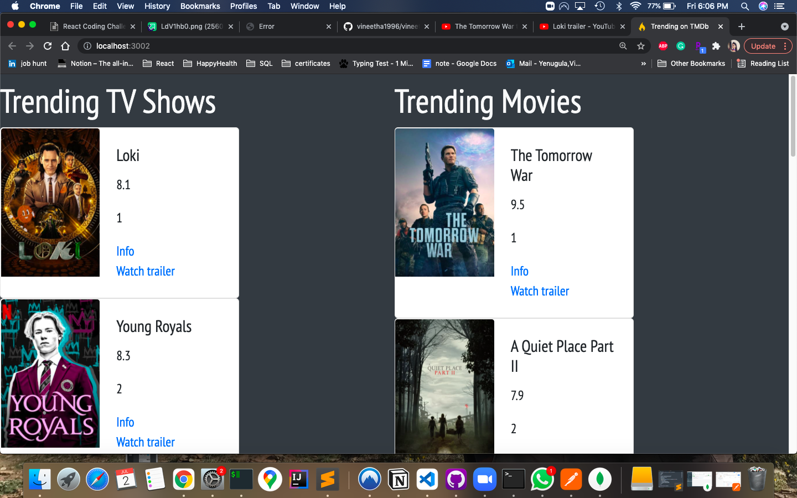
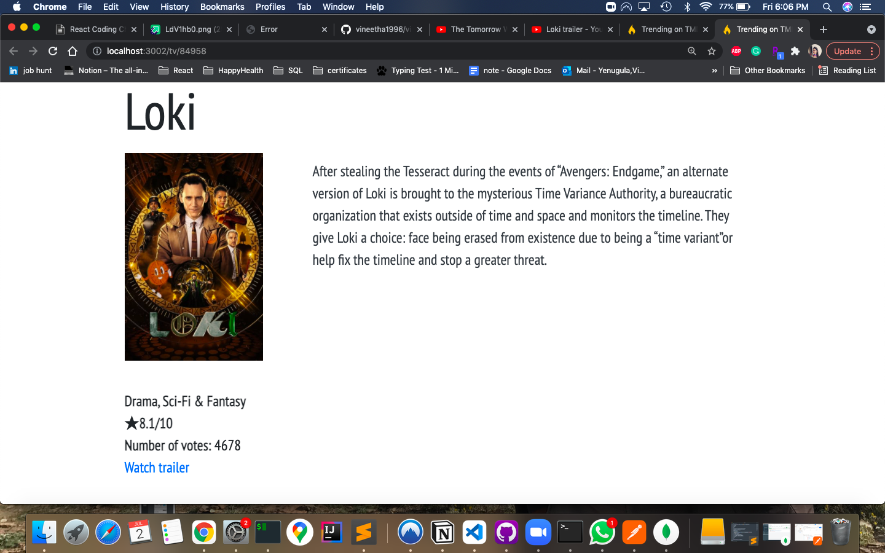
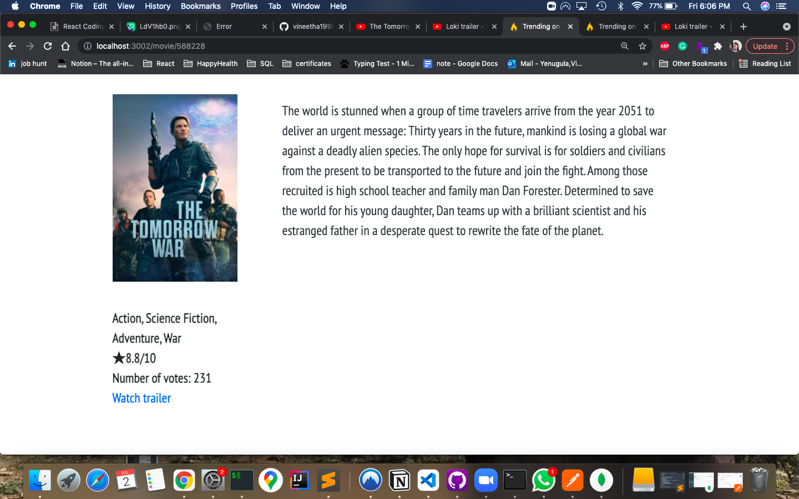
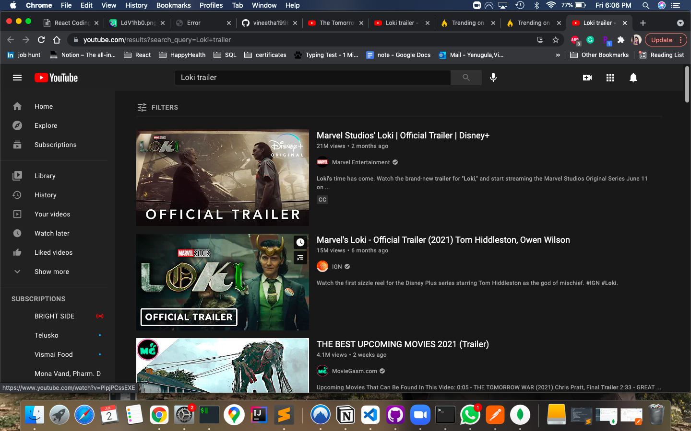

## Setup
- yarn start (backend)
- cd client & yarn start (frontend)
- Go to localhost:3000 (or some other port depending on log statement)
- Browse through trending homepage and visit either TV/Movie info page.

## Screenshots

